# Pipeline report

Repo of app and pipeline: https://github.com/khueile/flask-mysql 
Go to the link above to read this same report (readme.md) but with working link connected to appropriate files.

This repo can be used to prop up a 2-tier simple web application. The logic, as well as basic html interfacing, is handled by Flask. It interacts with a MySQL database (`student_database`) that has one table (`students`) in it to store student data.

Here are the stages I went through to prop this application up, **with increasingly more complicated CICD wrangling per stages**.

## Stage 0: Base app, no pipeline, no docker
First I want to show how the application works out of the box with no changes. 

Originally, the repo is forked from [here](https://github.com/kshyam/flask-with-sqlite). It's a crud flask application with a simple sqlite db attached that has one table in it.

By the time you're reading this report, that sqlite in the original set up has been replaced by mysql to create a more defined 2-tier architecture, so the following code in this stage no longer works. The following pics that shows the site features are still applicable in all later stages.

Set up a virtual env with specific requirements
```
cd flask-mysql
python3 -m venv venv
source venv/bin/activate
pip install -r requirements.txt
```
Start your Flask App in debug mode
``` 
flask --debug run
```
Check things out on your browser at
```
http://localhost:5000/
```
You can see the home page
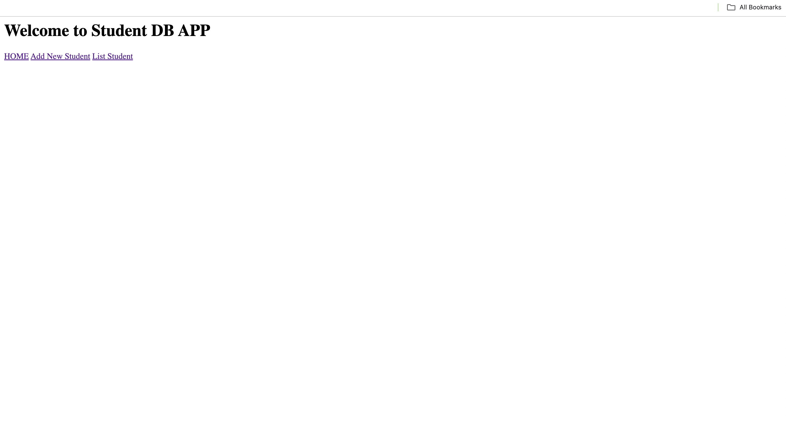
Click on `Add New Student` to get to this page. Let's fill out some random info too.
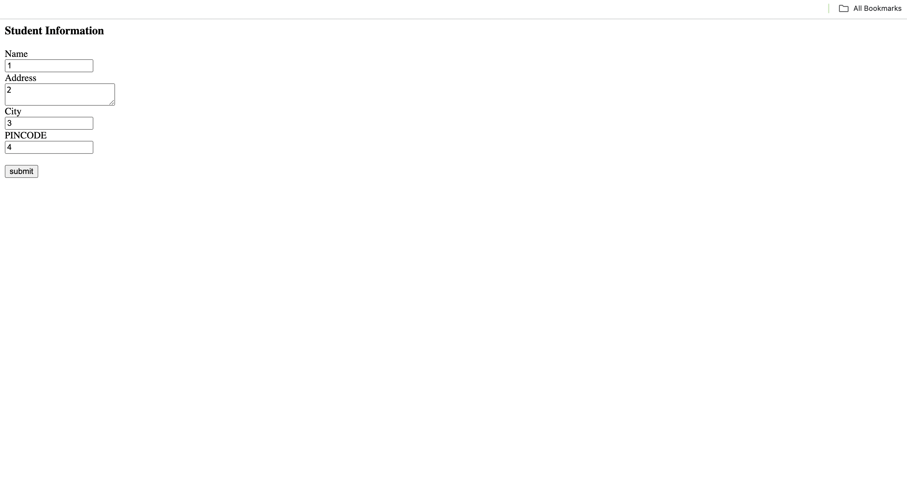
After clicking `submit`, you should see this page
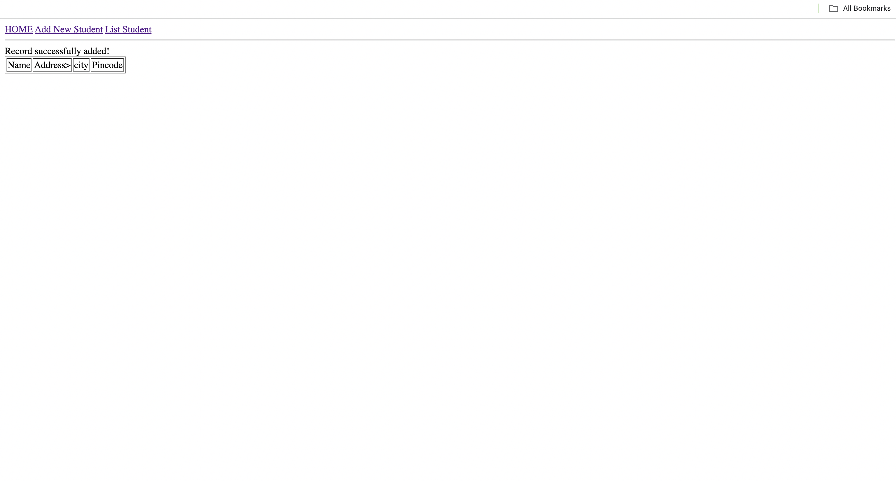
Click on `List Student`. You should see the info you just input in the list of students:
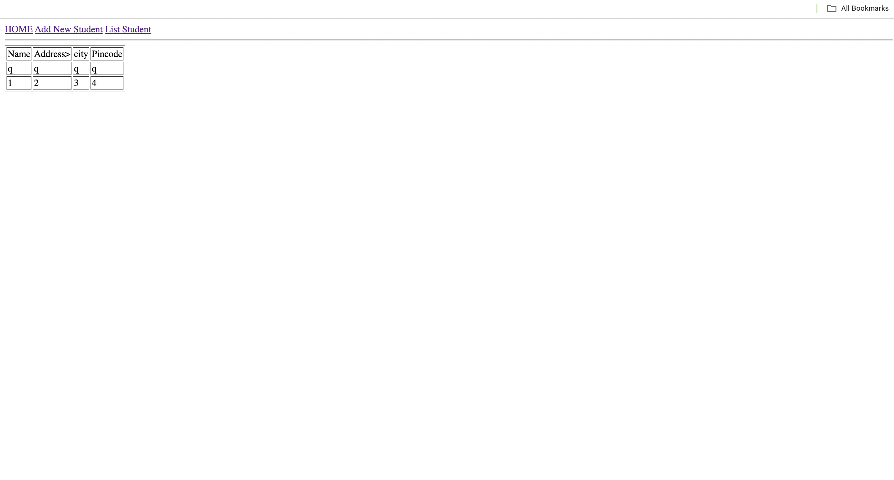

## Stage 1: Contanerize with Docker
We rely on 2 containers here, one for the flask app and one for the mysql database.

Dockerfiles for the app and db are at [`dockerfile_app`](dockerfile_app) and [`dockerfile_mysql`](dockerfile_mysql). `dockerfile_app` sets up a Docker container for a Flask application using a python base image. `dockerfile_mysql` is the db part.

To build the 2 images
```
cd flask-mysql
docker build -t mysql_image -f dockerfile_mysql .
docker build -t app_image -f dockerfile_app .
```

Skip to stage 2 if you want a better way to run these containers with Kubernetes. The following rest of stage 1 shows how to run the containers with only docker, which is not efficient and for record-keeping only:

Create the network for the 2 containers to live on and interract with each other
```
docker network create appnw
```

Run the 2 containers:
```
docker run -p 3306:3306 -d --network appnw --name mysql_container -e MYSQL_ROOT_PASSWORD=root -e MYSQL_DATABASE=student_database mysql_image
docker run -p 5000:5000 -d --network appnw --name app_container app_image
```

Check out the application at `http://127.0.0.1:5000`
You can also use curl to test:
```
curl http://127.0.0.1:5000/list
curl -X POST -d "name=lmao&address=lmao&city=lmao&pin=lmao" http://127.0.0.1:5000/addrec
```

You can also checkout the content of mysql database container by doing
```
docker exec -it mysql_container mysql -uroot -proot
```

## Stage 2: Add Kubernetes
After adding the .yaml files under k8s directory, the application will now consist of 2 deployments and 2 services:
- flask-deployment for the flask app
- mysql-deployment for the mysql database
- flask-service is a NodePort service that exposes the flask-deployment to allow us to interact with the Flask application from outside the cluster
- mysql-service is a ClusterIP service that allows the flask app side to read from and write to mysql side.

Note: At this point, I found that Docker, Docker Desktop, Docker Hub all integrate super well with each other, so I ended up just going with these tools for Kubernetes cluster set up and hosting images, instead of minikube and jfrog's artifactory. 

To create the cluster on MacOS host:
- Download Docker Desktop
- Open Docker Desktop > Preferences > Kubernetes
- Choose Enable Kubernetes
- Choose Apply and restart

Install kubectl: On macbook host, use brew package manager: `brew install kubectl`. After confirming it's working, configure to use docker-desktop cluster:
```
kubectl config use-context docker-desktop
```

The 2 deployments are created using images from `dockerfile_app` and `dockerfile_mysql`.
We have set up 2 repo on docker hub to store these images:

- [app_image](https://hub.docker.com/repository/docker/khueile/app_image/general)
- [mysql_image](https://hub.docker.com/repository/docker/khueile/mysql_image/general)

Here's how to build, tag, and push the 2 images to docker hub:

```
cd flask-mysql
docker build -t app_image -f dockerfile_app .
docker tag app_image khueile/app_image
docker push khueile/app_image

docker build -t mysql_image -f dockerfile_mysql .
docker tag mysql_image khueile/mysql_image
docker push khueile/mysql_image
```
To start the deployments and services:
```
cd flask-mysql/k8s
kubectl apply -f .
```
We should have something like this:
```
Minhs-MacBook-Pro:k8s minhkhuele$ kubectl get all
NAME                                    READY   STATUS    RESTARTS   AGE
pod/flask-deployment-67f9dddddf-jfgzk   1/1     Running   1          107m
pod/mysql-deployment-cf5f8c8fd-qxvr7    1/1     Running   1          147m

NAME                    TYPE        CLUSTER-IP       EXTERNAL-IP   PORT(S)          AGE
service/flask-service   NodePort    10.103.191.191   <none>        5000:30000/TCP   3h38m
service/kubernetes      ClusterIP   10.96.0.1        <none>        443/TCP          4d2h
service/mysql-service   ClusterIP   10.106.243.70    <none>        3306/TCP         4d1h

NAME                               READY   UP-TO-DATE   AVAILABLE   AGE
deployment.apps/flask-deployment   1/1     1            1           107m
deployment.apps/mysql-deployment   1/1     1            1           4d1h

NAME                                          DESIRED   CURRENT   READY   AGE
replicaset.apps/flask-deployment-67f9dddddf   1         1         1       107m
replicaset.apps/mysql-deployment-cf5f8c8fd    1         1         1       147m
```

Now we can check out the app at `http://localhost:30000/`. Refer to stage 0 documentation for how to use the app.

## ~~Stage 3: Add manual Jenkins config~~ Skip this stage, go to stage 4 for exact same pipeline  + creds but automated setup with init.groovy
Please skip to stage 4 to see use of `init.groovy` to automate setting up jenkins pipeline job + credentials. This stage 3 doc below is just for record keeping.

### 3.1: install Jenkins with Helm

We need helm to install Jenkins on our cluster. To install Helm CLI, on my macbook, we used brew package manager (https://helm.sh/docs/intro/install/)
```
brew install helm
```

Add the Jenkins Helm Repo per this guide (https://medium.com/@viewlearnshare/setting-up-jenkins-with-helm-on-a-kubernetes-cluster-5d10458e7596)
```
Minhs-MacBook-Pro:flask-mysql minhkhuele$ helm repo add jenkins https://charts.jenkins.io
"jenkins" has been added to your repositories
Minhs-MacBook-Pro:flask-mysql minhkhuele$ helm repo list
NAME    URL                      
jenkins https://charts.jenkins.io
Minhs-MacBook-Pro:flask-mysql minhkhuele$ helm repo update
Hang tight while we grab the latest from your chart repositories...
...Successfully got an update from the "jenkins" chart repository
Update Complete. ⎈Happy Helming!⎈
```

Install on current cluster:
```
Minhs-MacBook-Pro:flask-mysql minhkhuele$ helm install jenkins jenkins/jenkins
NAME: jenkins
LAST DEPLOYED: Wed Oct 23 14:52:20 2024
NAMESPACE: default
STATUS: deployed
REVISION: 1
NOTES:
1. Get your 'admin' user password by running:
  kubectl exec --namespace default -it svc/jenkins -c jenkins -- /bin/cat /run/secrets/additional/chart-admin-password && echo
2. Get the Jenkins URL to visit by running these commands in the same shell:
  echo http://127.0.0.1:8080
  kubectl --namespace default port-forward svc/jenkins 8080:8080

3. Login with the password from step 1 and the username: admin
4. Configure security realm and authorization strategy
5. Use Jenkins Configuration as Code by specifying configScripts in your values.yaml file, see documentation: http://127.0.0.1:8080/configuration-as-code and examples: https://github.com/jenkinsci/configuration-as-code-plugin/tree/master/demos

For more information on running Jenkins on Kubernetes, visit:
https://cloud.google.com/solutions/jenkins-on-container-engine

For more information about Jenkins Configuration as Code, visit:
https://jenkins.io/projects/jcasc/


NOTE: Consider using a custom image with pre-installed plugins
```
Follow step 1 through 3 (not 4 and 5 though yet, go to stage 4 for that). 


### 3.2: Installing and configuring plugins in Jenkins

We need the `git` and `github` plugin to help trigger jenkins pipeline whenever there's a change in the repo, as well as docker pipeline `docker-workflow` plugin to build and push docker images to docker hub.


### 3.3: Create the pipeline
Now we start configuring our pipeline.

(I used this post as guidance: https://medium.com/@mudasirhaji/complete-step-by-step-jenkins-cicd-with-github-integration-aae3961b6e33, specifically the portion about github configuration at Step 3: Start Using Jenkins)

1. On Jenkins home page, choose `New Item`.
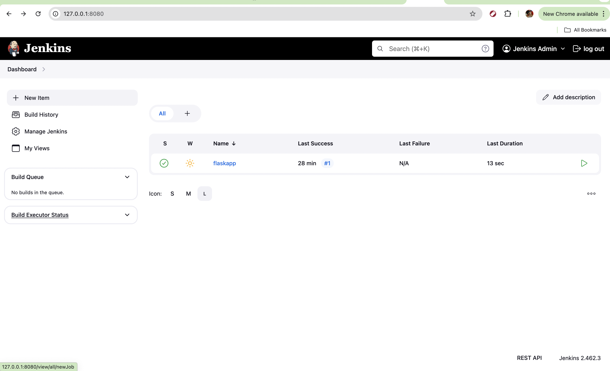
2. Pick the `Pipeline` option, then input the name. In this case I input `flaskapp`.
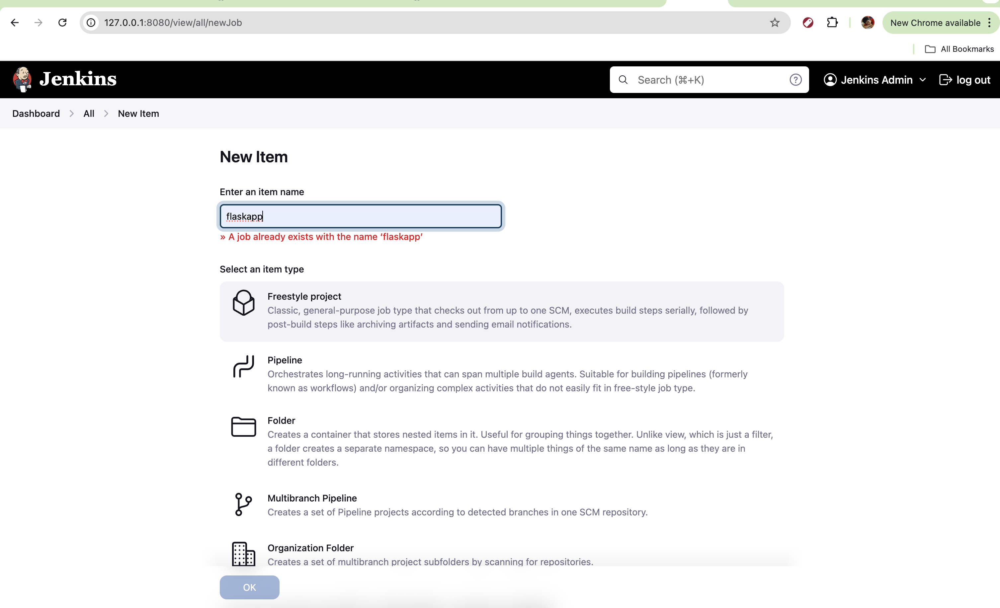
3. Under Build Triggers, check the box for `Poll SCM` and input `H/15 * * * *` to the schedule. 
4. Under `Source Code Management`, input the url to our git repo 
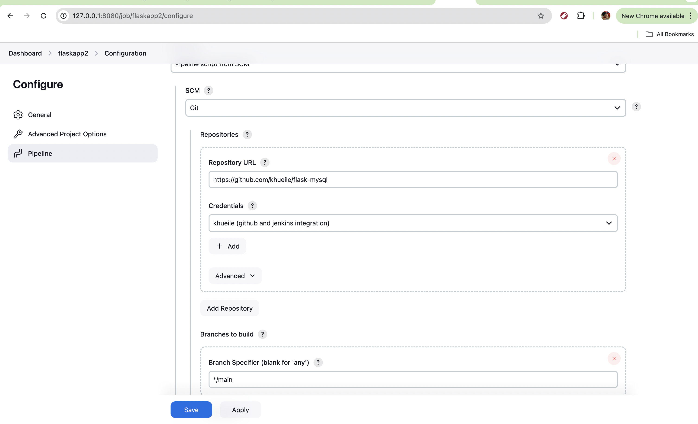
5. Then under `Credentials`, chose `Add` then `Jenkins` to add credentials. In this case I used `SSH Username with Private Key`, then entered a key I already am using for github access
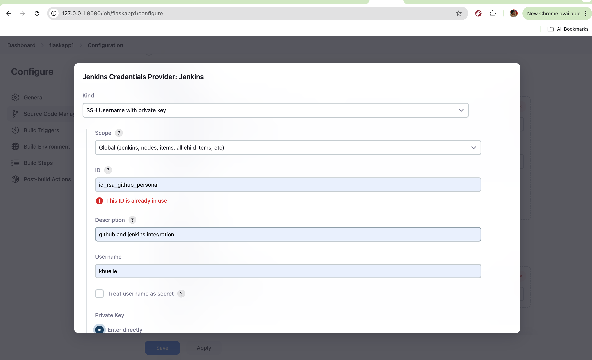
6. Under `Branches to build`, input `*/main`
7. Save.

### 3.4: Jenkinsfile
Check out the Jenkinsfile for the precise instruction. Generally, the steps mirror commands used in stage 1 to build and push docker containers to docker hub:
- Checkout the repo if scm polling detects changes in main branch
- Build app image with docker
- Push app image to docker hub

## Stage 4: Automate Jenkins pipeline job setup
### 4.1: Jenkins Setup
Under `jenkins/init.groovy.d`, create 2 files:
- `id_rsa_github_personal`: contains private ssh key that's already configured in github to clone repo.
- `pass`: contains the password to docker hub account

Then, using this [dockerfile](jenkins/dockerfile), spin up a docker container that is a modified version of Jenkins with all needed plugins (`docker-workflow`, `git`, etc.) already installed as following:
```
cd jenkins
docker build -t jenkins-devops .
docker run -p 8080:8080 -p 50000:50000 --restart=on-failure -v jenkins_home:/var/jenkins_home -v /var/run/docker.sock:/var/run/docker.sock jenkins-devops
```
Open jenkins on localhost:8080 and you should see this screen:
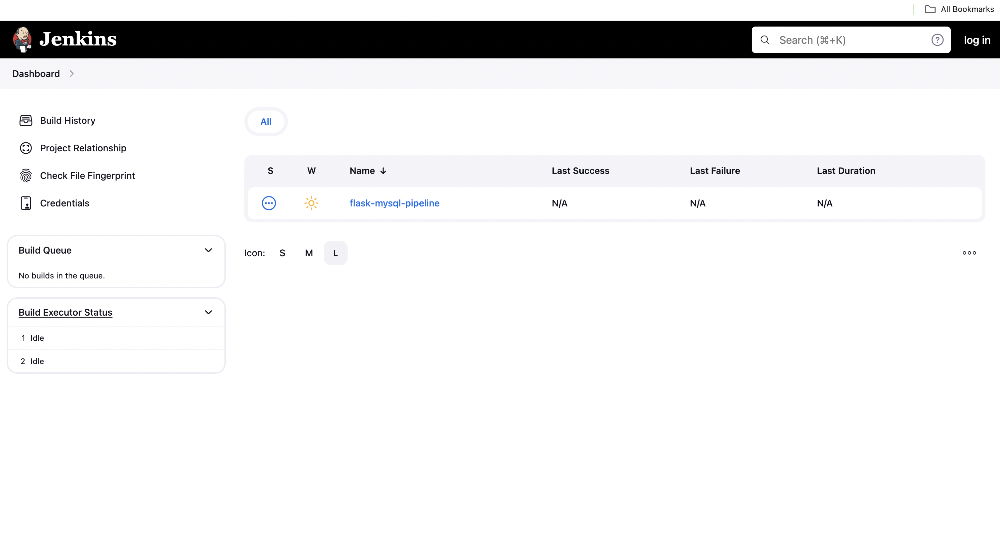
Note that the pipeline `flask-mysql-pipeline` is already configured automatically.
This is what the pipeline looks like when it's executed successfully.
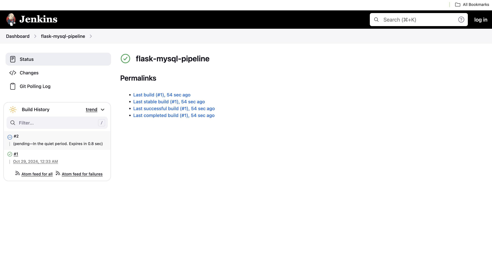
The pipeline job and related credentials are already configured by the [groovy.init](jenkins/init.groovy.d/init.groovy) script. Specifically, the script sets up the pipeline job, the scm polling, and docker hub and github credentials needed for the pipeline to work.

### 4.2: Console output:
The console output text could be found [here](jenkins_success_console_output.txt). Here are some pics for proof:
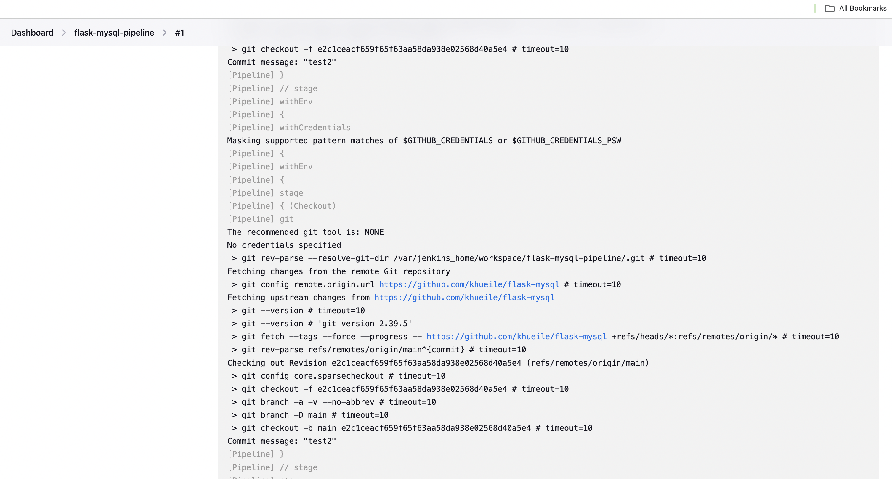
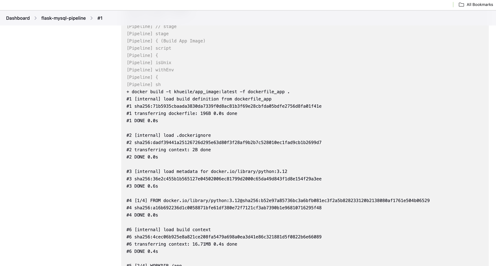
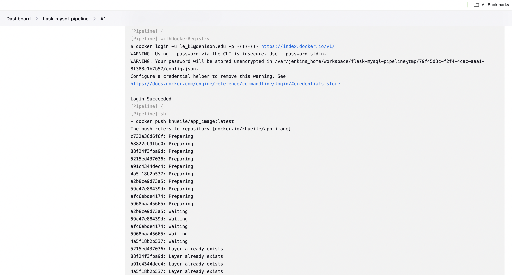
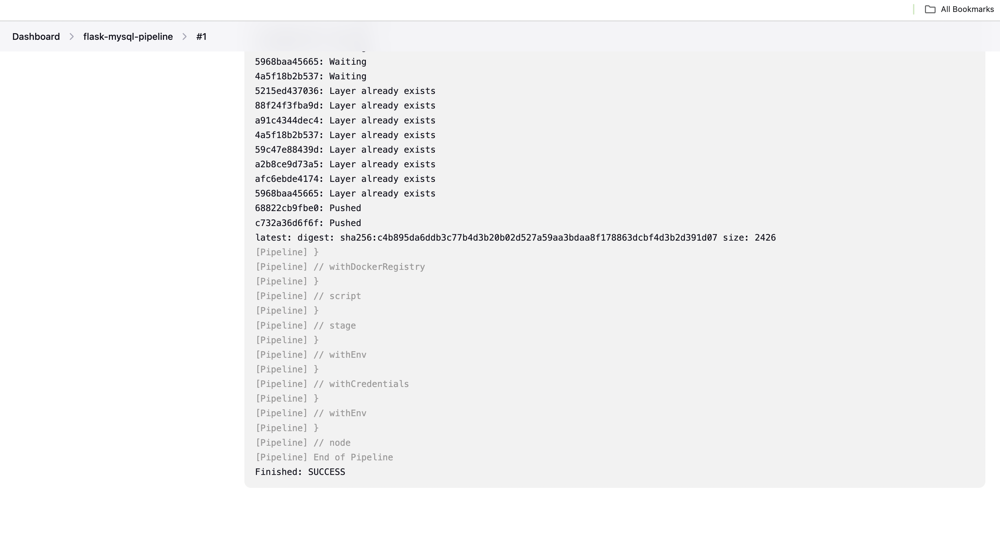

Check out the Jenkinsfile for the precise instruction. Generally, the steps mirror commands used in stage 1 to build and push docker containers to docker hub:
- Checkout the repo if scm polling detects changes in main branch
- Build app image with docker
- Push app image to docker hub

## Stage 5: ArgoCD

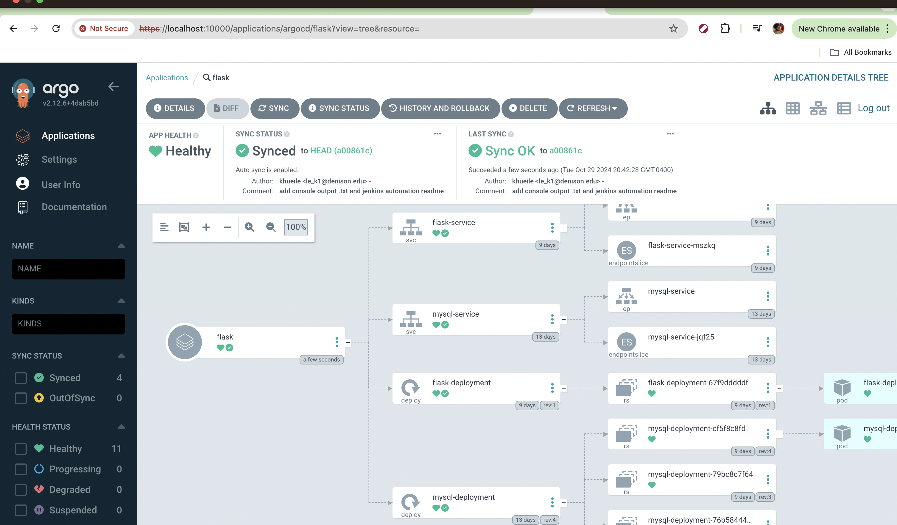

Command to set up argocd:
```
kubectl create ns argocd
kubectl apply -n argocd -f https://raw.githubusercontent.com/argoproj/argo-cd/stable/manifests/install.yaml
```
Check for success setup
```
kubectl get all -n argocd
```
Port forward to allow us to check the UI locally:
```
kubectl port-forward svc/argocd-server -n argocd 10000:443
```
Check out the UI at `localhost:10000`. Username is `admin`, and password is as following:
```
kubectl -n argocd get secret argocd-initial-admin-secret -o jsonpath="{.data.password}" | base64 --decode ; echo
```
You should see something like this:

Choose `NEW APP` > `EDIT AS YAML`, then paste the `manifest.yaml` in this repo to it. If all goes well, this would show up:
